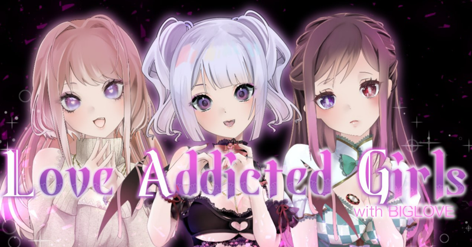

# Generative NFT Art

## Introduction

The `generative-art-nft` repository is a library for creating generative art. It was developed for the purpose of creating NFT avatar & collectible projects. This library was used to generate the artwork for the [Love Addicted Girls](https://www.soudannft.xyz) project.

## Features

### Generate over a million distinct images with less than 60 traits
The library allows you to generate images every distinct possible combination of your traits. For context, if you had trait art for a project like [Bored Apes](https://boredapeyachtclub.com/#/home), the library could generate upwards of 1.2 billion distinct apes.

### Add rarity weights
The library also allows you to configure the image generation process in such a way that you have complete control over how rare each and every trait is.

### Generate compliant JSON metadata for your NFTs
There is now an added functionality to generate JSON metadata for your NFTs that are in compliance with OpenSea metadata requirements (and by extension, the general NFT metadata standard).

### Fuzzy friendly
You can use this library even if you do not know how to program (in Python or otherwise). Do check out the [Tutorial](https://medium.com/scrappy-squirrels/tutorial-create-generative-nft-art-with-rarities-8ee6ce843133) for more details on how to use (non-technical) and extend (technical) the library.

## Installation

**Clone this repository**

```git clone https://github.com/gurujowa/generative-art-nft.git```

**Install required packages**

```pip install Pillow pandas progressbar2```

Upload your input assets in the `assets` folder, fill up the `config.py` file, and then run `python nft.py`.

In order to generate JSON metadata, define BASE_NAME, BASE_IMAGE_URL, and BASE_JSON in `metadata.py` and then run `python metadata.py`.

## Usage

This project is forked from Scrappy Squirrels. Scrappy Squirrels have good Document. Check it out [here](https://medium.com/scrappy-squirrels/tutorial-create-generative-nft-art-with-rarities-8ee6ce843133)

The following features have been added to this program.
- The output metadata is now compatible with [ThirdWeb](https://thirdweb.com/).
- Added support for one-to-one parts, such as front hair and back hair.
- Added DockerFile, .gitignore, etc.

## About Love Addicted Girl Project



This library was created as part of the Love Addicted Girl project.

Love Addicted Girl is a collection of 2,000 randomly generated NFTs on the Polygon Blockchain. LoveAddicted Girl are meant for buyers, creators, and developers who are completely new to the NFT ecosystem.

The community is Built by SoudanNFT. SoudanNFT is Japanese NFT creator and investor community.